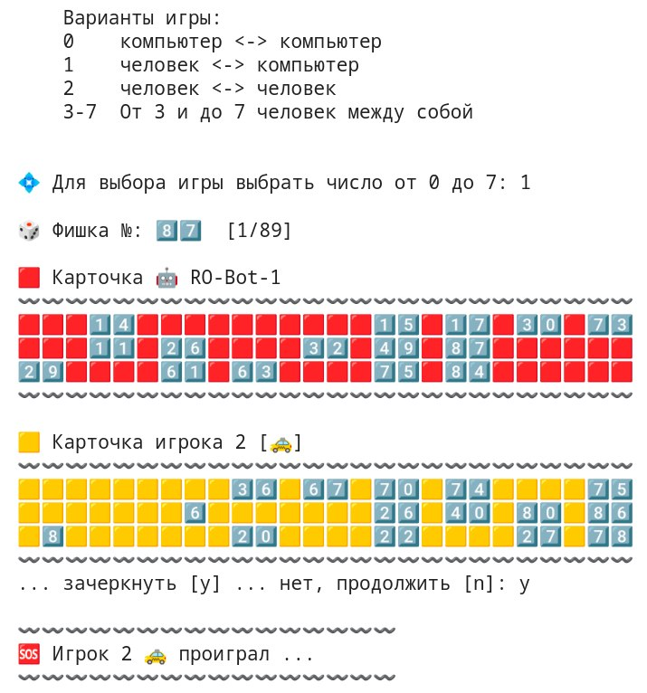

# Python_P.L09
## **Lotto "Игра лото"**
---

1. Создать новый проект "Игра лото""
2. Правила игры можно посмотреть тут:  
**https://github.com/dmitry-vs/python-loto-game**
(Если не получается перейти по ссылке, скопируйте и вставьте в строку браузера самостоятельно)

3. Написать игру лото.
 
Возможные подходы к решению задачи:
1) Проектирование на основании предметной области. Подумать какие объекты есть в игре и какие из них можно перенести в программу. Для них создать классы с соответствующими свойствами и методами. Проверить каждый класс отдельно. Написать программу с помощью этих классов;
 
2) Метод грубой силы + рефакторинг. Написать программу как получиться. После этого с помощью принципа DRY убрать дублирование в коде;
 
3) Процедурное программирование.
 
4. Минимальные требования: 2 игрока - человек играет с компьютером;
5. (Дополнительно ``*``) возможность выбирать тип обоих игроков (компьютер или человек) таки образом чтобы можно было играть: компьютер - человек, человек - человек, компьютер - компьютер;
6. (Дополнительно **``*``) возможность играть для любого количества игроков от 2 и более**;
 
7. Выложите проект на **github**
8. Можно сдать задание в виде **pull request**

---

---
# Python_P.L10
- Написать тесты для проекта с помощью pytest или unittest
- Определить процент покрытия тестами с помощью pytest-cov
- Создать pull request на объединение веток master и новой ветки с тестами, прислать ссылку на pull request как решение дз

**Branche: [https://github.com/dnp34/Python_P.L09.git]**

---
# Python_P.L11
- Для каждого класса в программе добавить магический метод __str__, если еще не было!
- Для каждого класса сделать возможность сравнения 2-х объектов этого класса (a == b, a != b), если это применимо
- Использовать любые подходящие магические методы для того чтобы сделать код более читаемым и удобным для переиспользования, где имеет смысл!
- Покрыть новый код тестами
- Создать pull request на объединение веток master и новой ветки с тестами, прислать ссылку на pull request как решение дз.
